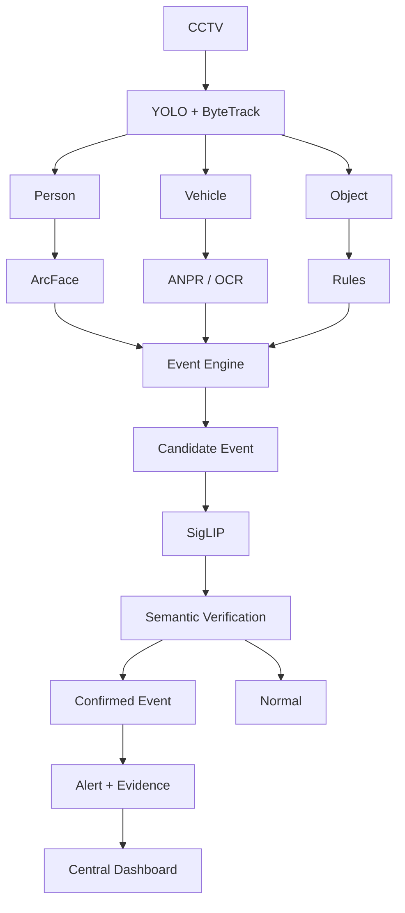

# SCOPE

### Surveillance Computer Observation & Perception Engine

AI-based video analytics platform for intelligent CCTV monitoring and border surveillance.

## Problem Statement

**SIH26187 – AI-Based Intelligent Video Analytics Platform for Border Surveillance**

Traditional CCTV systems mainly provide live video and recording, requiring security personnel to continuously monitor multiple cameras.

SCOPE aims to add an AI-based analytics layer to existing CCTV infrastructure to automatically detect, track, identify, and report security-related events.

## Features

* Human detection and tracking
* Vehicle detection and classification
* Face detection and recognition
* Automatic Number Plate Recognition (ANPR)
* Virtual fence / restricted-zone detection
* Suspicious activity detection
* Night-time movement detection
* Real-time alerts
* Event logging with evidence
* Centralized monitoring dashboard

## Architecture

