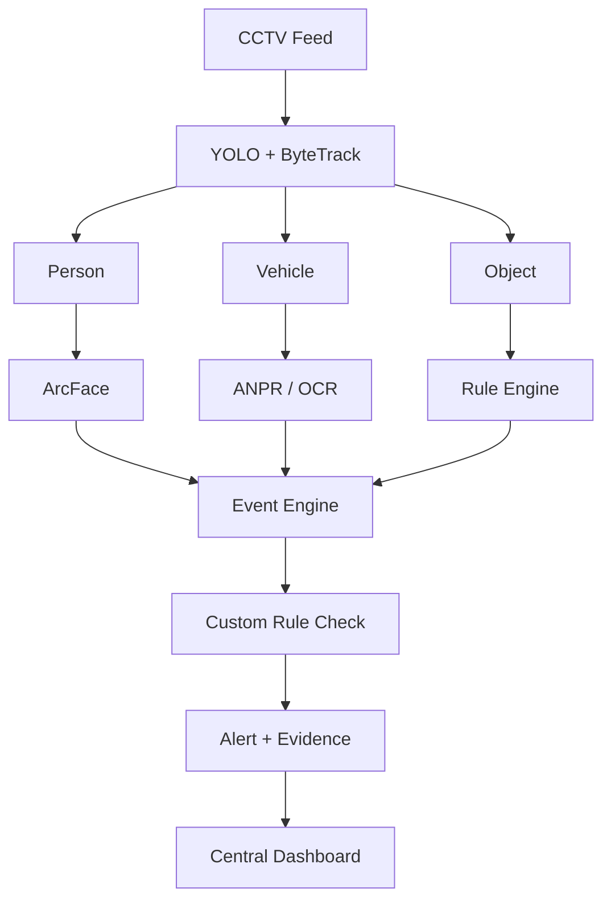
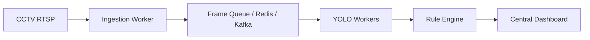

# SCOPE

### Surveillance Computer Observation & Perception Engine

AI-based video analytics platform for intelligent CCTV monitoring and border surveillance.

## Problem Statement

**SIH26187 – AI-Based Intelligent Video Analytics Platform for Border Surveillance**

Traditional CCTV systems mainly provide live video and recording, requiring security personnel to continuously monitor multiple cameras.

SCOPE aims to add an AI-based analytics layer to existing CCTV infrastructure to automatically detect, track, identify, and report security-related events.

## Prototype Status

This project is currently a basic prototype focused on rule-based surveillance logic and event generation. It demonstrates core object detection, person/vehicle tracking, face recognition, OCR-based number plate reading, and restricted-zone alerting using custom logic.

This is not yet a full production-ready border security system. The architecture below reflects the current implementation and the future roadmap for expansion.

## Current Prototype Features

* Human detection and tracking
* Vehicle detection and classification
* Face detection and recognition
* Automatic Number Plate Recognition (ANPR)
* Virtual fence / restricted-zone detection
* Rule-based intrusion and vehicle alerts
* Night-time movement detection
* Real-time alerts
* Event logging with evidence
* Centralized monitoring dashboard

## Current Prototype Architecture

## Critical Operational Gaps (High Priority)

### 1. Thermal / IR Fusion Logic

- The Gap: Standard YOLO RGB models fail in low-light, dense smoke, or foggy conditions.
- Fix: Add a multi-modal preprocessing layer or dual-stream inference (RGB + Thermal/LWIR) before feeding frames to YOLO + ByteTrack.

### 2. Re-Identification (ReID) Across Camera Networks

- The Gap: ByteTrack tracks objects only within a single camera feed (`track_id`). When a subject leaves Camera A and enters Camera B, they get a different ID.
- Fix: Add a Multi-Camera Multi-Target (MCMT) ReID module using visual feature vectors (for example, FastReID) so the system tracks a person or vehicle across the entire border network continuously.

### 3. Camera Tampering & Motion Anomaly Detection

- The Gap: If a camera is covered, blinded, sprayed, or physically displaced, the current rule engine will not detect it.
- Fix: Implement background subtraction or optical flow checks to flag Camera Occlusion, Blindness, and Scene Drift.

## Technical & System Architecture Gaps

### 1. Frame Decoupling & Queue Pipeline

- The Gap: The current prototype connects CCTV directly to YOLO. Running ArcFace and OCR synchronously on every frame under live RTSP load may lead to GPU pressure and severe frame drops.
- Fix: Introduce an RTSP ingestion engine using DeepStream, FFmpeg, or GStreamer that pushes frames to a queue, decoupled from model workers.

### 2. Spatial Tracking (Geo-Mapping / GPS Coordinates)

- The Gap: Pixel coordinates `(x1, y1, x2, y2)` are not useful to field officers on a GIS dashboard.
- Fix: Apply a homography or perspective transformation to map bounding box coordinates into real-world map coordinates.

## Analytics & Intelligence Gaps

### 1. Behavioral & Loitering Analysis

- The Gap: Detecting a person inside a fence is basic intrusion detection; knowing whether they are loitering, crawling, carrying a weapon or payload, or dropping an object requires temporal and pose-based understanding.
- Fix: Add pose estimation (for example, YOLO-Pose) to detect crawling, scaling fences, or abandoned objects.

### 2. Dynamic Bandwidth & Edge Optimization

- The Gap: Border posts often have poor or unreliable network links. Sending raw video to a central dashboard will strain network bandwidth.
- Fix: Process models at the edge on Jetson or similar devices, and send only lightweight JSON metadata plus cropped evidence thumbnails to the central dashboard, streaming full video only on demand.

## Summary

SCOPE is currently a prototype for rule-based border surveillance analytics. It validates the core workflow of detection, recognition, restricted-area checks, and event logging in a real-world CCTV pipeline. The features below are planned future upgrades to evolve this into a robust, field-ready surveillance intelligence platform.

This is just a basic prototype and not yet a complete operational surveillance system.